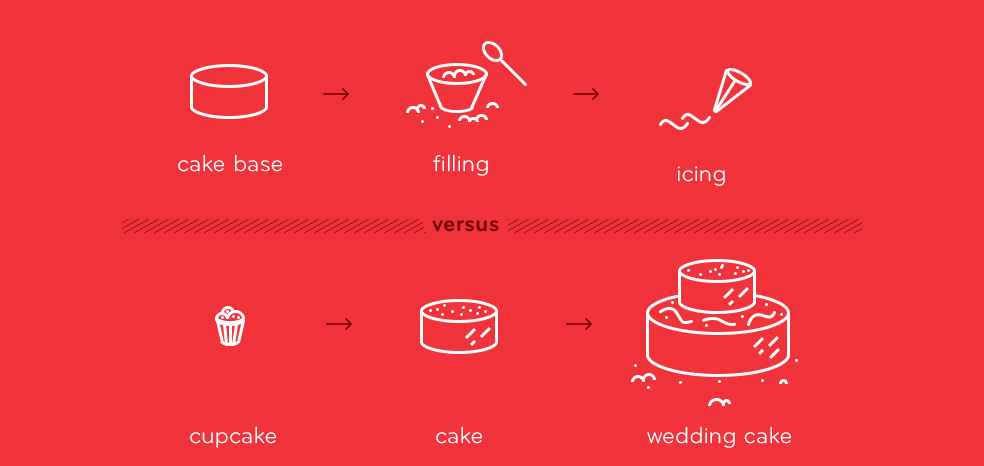

# Setting the Stage

## Why do we test?

As designers we are often confronted with the question “How do we know our design works?”, whether it's a matter of introspection or presenting and justifying our design decisions.

While testing seems like the obvious answer, it is important to realize that testing is not a single summative phase in the entire project (as in SDLC). Rather it is a formative process that is distributed throughout the design process.

Testing, creativity, and empathy are the fundamental pillars of the user-centered design sprint process at Axis. 

Using these fundamentals we are able to iteratively deliver applications that are useful, usable, and delightful at every stage. The following diagram encapsulates our sprint philopsophy where we aim to deliver not only bigger and better iterations but also wholesome at every stage.

Testing allows us to step back and backup assumptions made along the way with empirical evidence. 
All in all, it helps us-

- Mitigate the risk of major redesign later in the process(small changes are bound to happen)
- Increase likelihood of User adoption

## But how do we REALLY test during a sprint?

Because testing is distributed among our sprint phases, it can manifest in many ways ranging from casual coffee shop studies to controlled experiments depending on the research context, time at hand, and access to participants.

And while testing is a core philosophy of the UCD process, a point of tension emerges during **Lean Design Sprints**, where time and resources are limited and compromises must be made in the name of fast delivery.

How then can designers balance the need for robust testing versus quick turnaround times?

## Heuristic approach

> **Heuristic techniques** often called simply a heuristic. It is any approach to problem solving, learning, or discovery that employs a practical method not guaranteed to be optimal or perfect, but sufficient for the immediate goals. 
>
> Where finding an optimal solution is impossible or impractical, heuristic methods can be used to speed up the process of finding a satisfactory solution.Heuristics can be mental shortcuts that ease the cognitive load of making a decision. 
>
> Examples of this method include using a rule of thumb, an educated guess, an intuitive judgment, guesstimate, stereotyping, profiling, or common sense.

[Source: Wikipedia](https://en.wikipedia.org/wiki/Heuristic)

Based on this heauristic approach we advocate the following-
1. [Follow best practices, don't re-invent the wheel](../1.Follow-best-practices)
2. [Know what to measure](../2.Determine-research-questions)
3. [Know how to measure](../3.Plan-the-test)
4. [Conduct the test](../4.Conduct-the-test)
5. [Act on your findings](/5.Act-on-your-findings)

Before we dive deeper into any of these individual steps, it is be helpful to:
- Understand the inherent [complexity](Challenges.md) that comes with evaluating a data visualization, 
- Understand the [pitfalls](Pitfalls.md) with the current evaluation methodologies, in order to prevent yourself from falling into them, and
- Equip yourself with the [testing mindset](TestingMindset.md) in order to properly set expectations.

