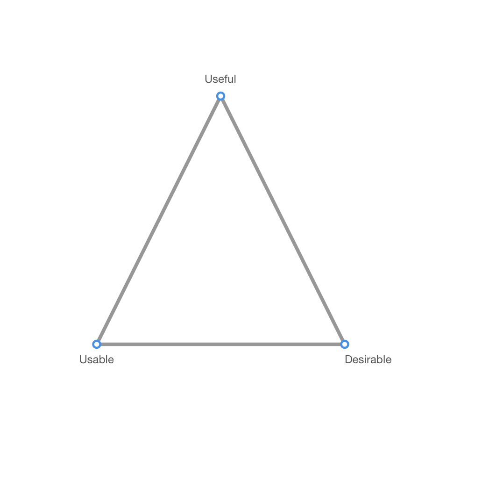

## The Complexity in our Stars

This is a very important step because

- Data Viz is inherently hard to test

Why is Data viz hard to test?

Faster is not necessarily better

**Visualization is outcome driven. Very rarely are our users making  visceral decisions based on a vis, and while we care about the affective value of a vis, we don’t want them making emotional decisions (as we would on an ecommerce site)We don’t want to penalize a vis because it makes a user think. Similarly, no. of errors is not a good measure either

Examples of what all can be tested-

Tradeoffs involved

… Hence, one has to be intentional about what to test.

- Open ended tests reveal all sorts of feedback, with a UI as complex as a dashboard this can pose a serious challenge as there are so many rabbit holes you could fall under
- ​

## Useful, Usable, Desirable Framework

Reflective/ Behavioral/Visceral characteristics

​					

## 

