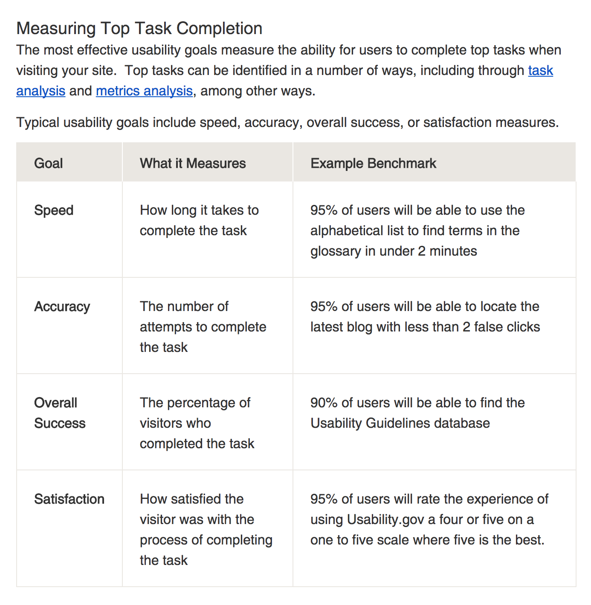
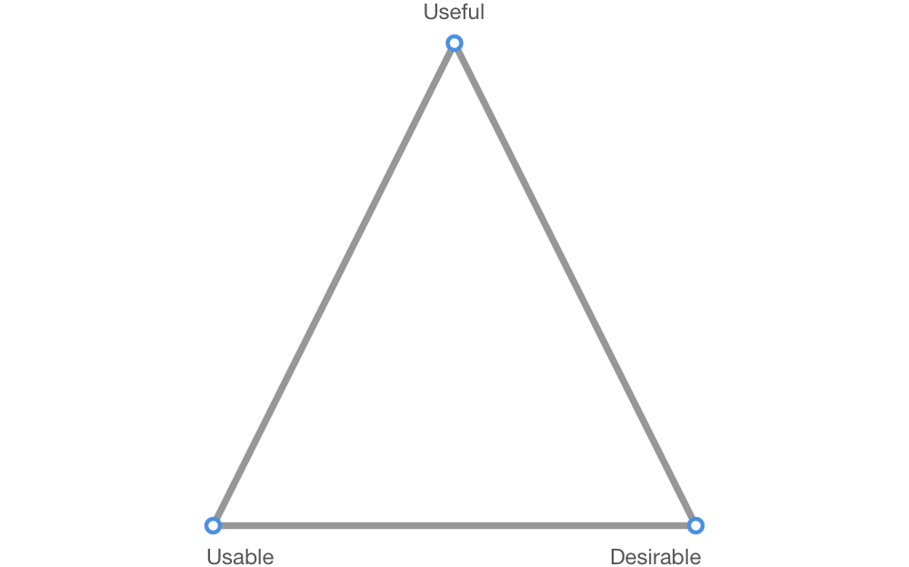
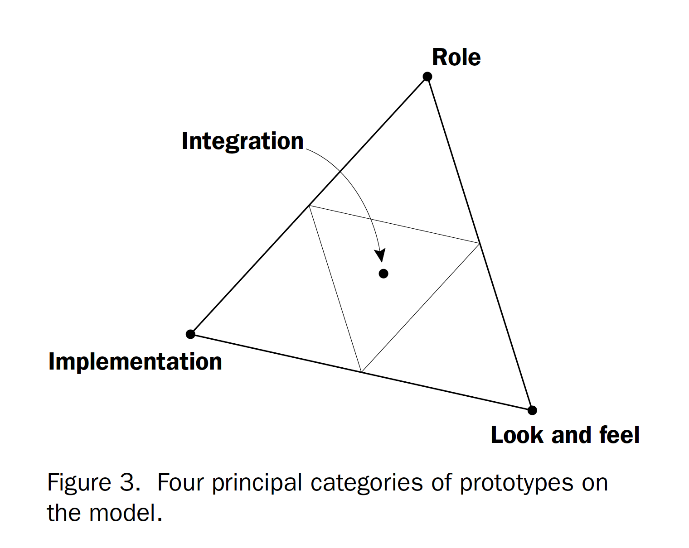

# Table of Contents
  * [Know what you are testing](#know-what-you-are-testing)
  * [Useful, Usable, Desirable Framework](#useful-usable-desirable-framework)
      * [Useful](#useful)
        * [Informative](#informative)
        * [Effective](#effective)
        * [Insightful](#insightful)
        * [Well Documented](#well-documented)
        * [Trustworthy](#trustworthy)
        * [Purposeful](#purposeful)
    * [Usable](#usable)
      * [Learnable](#learnable)
      * [Efficient](#efficient)
      * [Intuitive](#intuitive)
      * [Safe](#safe)
    * [Desirable](#desirable)
      * [Aesthetic](#aesthetic)
      * [Enjoyable](#enjoyable)
      * [Exciting](#exciting)
      * [Memorability](#memorability)
* [Unwanted Attributes](#unwanted-attributes)
  * [Inefficient](#inefficient)
  * [Confusing](#confusing)
  * [Frustrating](#frustrating)
  * [Boring](#boring)
  * [Making One Feel Stupid](#making-one-feel-stupid)
  * [Gimmicky](#gimmicky)
  * [Untrustworthy](#untrustworthy)
* [What Next? (Determine style of data)](#what-next)
* [References](#references)

#  Know what you are testing

The following image from Usability.gov describes some user performance metrics that can be paired with a task based test to gather quantitative data about our application.

*Source: [Usability.gov](https://www.usability.gov/get-involved/blog/2013/09/measurable-usability-goals.html)*

While these metrics are a good start and seem fairly straightforward, quantitative tests such as this require a large sample size to produce meaningful results. Additionally, it is hard to come up with diagnostic recommendations based on these numbers alone. As such, we came up with a basic **"Useful, Usable, Desirable"** framework that poses broader questions to tease out where and why an application's usability falls short.

# Useful, Usable, Desirable Framework

While there are many different ways to categorize qualities of a visualization we will look at them from the lens of Usefulness, Usability and Desirability. The rationale behind this is that these roughly map to reflective, behavioral and visceral feedback from users.

- Usefulness- How do people think about the interface?
- Usable- How do people behave with the interface?
- Desirable- How do people react to the interface?

We use these dimensions as higher order categories as axes to reflect on rather than hard and fast rules. These dimensions form a 3-dimensional space against which important aspects of the interface can. It is important to understand that individual attributes lie on a spectrum rather than being purely usable, purely useful or purely desirable as does the actual interface.

​					

This model is akin to [Houde and Hill's prototype model](https://pdfs.semanticscholar.org/30bc/6125fab9d9b2d5854223aeea7900a218f149.pdf), pictured below, that shows four different categories of prototypes(role, implementation, look and feel and integration). 

## Useful

#### Informative
- Does the visualization reveal trends, patterns, gaps, or outliers? 
- Can the viewer make effective comparisons?
- Does the visualization answer key questions from interviews/persona cards?

#### Effective
- Does each visualization successfully highlight important information, while providing context for that information? If something isn't normal, can the user immediately tell? 
- Does each visualization support the user's daily/weekly/monthly tasks? 
- Does each visualization allow the user to answer his/her questions when looking at those particular metrics?

#### Insightful
- Does it provide insight or understanding that was not obtainable with the original representation, text or table, etc?
- Does it provide insight or understanding better than some alternative visualization would? Or does it require excessive cognitive effort?
- Does the visualization provide information that is actionable?
- Is there appropriate context that gives meaning to metrics? (i.e. benchmark, change since last time period)

#### Well Documented
Even though it is better if the system can be used without documentation, it may be necessary to provide help and documentation. 

- Is the help documentation easy to find?
- Is help documentation easy to search? Is it focused on the user's task?
- Does it list concrete steps to be carried out without being overwhelming?

#### Trustworthy
- Does it maintain a proper scale?
- Does it represent measures using approproate visuals?
- Does it provide enough context to the user?
- Is the data accurate?

#### Purposeful
- Does each visualization have a specific goal? For example, is it to provide context, support analysis, or enable action?
- What specific question(s) is the visualization aiming to answer? Does it do so? 

## Usable
To what degree does the product behave in a way that users expect it to? 
How easy is it for users to use it for what they intended to?  

This can further be broken down as the following attributes:

#### Learnable

- **Focused**
    - Is it immediately understandable? If not, is it understandable after a short period of study?
    - Are the titles of charts and screens clear enough to indicate the purpose of the view? 
    - Is the information architecture succinct and organized enough to enable a user to find what he/she is looking for? 

- **Guided/Provides Scaffolds**
    - Does the interface guide and constrain users to select appropriate actions when initially learning?
    - Does the interface provide help messages to users so they can recognize, diagnose, and recover from errors?

- **Adaptive**
    - Does the interface mature as the user gains more experience?

- **Transferable**
    - Are users able to apply learning from one context to another?
    - Is terminology, styles, and interactions consistent?

- **Rewarding/Motivating**
    - Are users encouraged to explore the interface?
    - Are error messages expressed in plain language (no codes)?
    - Do they precisely indicate the problem, and constructively suggest a solution?

#### Efficient
- Can the user glean the necessary information without too much cognitive load?
- Does the visualization support common tasks with a minimal amount of steps? For example, if a user needs to view how sales has changed every day, does the dashboard provide quick, easy, and clear visibility to this information?
- Can a high level of productivity be sustained once users have learned how to use the dashboard to carry out tasks, or how to properly read a visualization?
- Think through some other visualizations that might accomplish the same goal, and evaluate whether your visualization is truly the most efficient. For example, if somebody has given you a set of multiple pie charts, and you have to compare pie wedges, from one to the other, is that really the best way to make those comparisons, or could a bar chart have done the job just as well, maybe better?

#### Intuitive
- Is there appropriate feedback in the design that indicates to the user what action was just taken? For example, what might differentiate between a hovered vs. unhovered state?
- Are appropriate affordances utilized to indicate that a user can take action (i.e. hover/click) on specific data elements?
- Is there a clear hierarchy of information?

#### Safe
Safety involves protecting users from undesirable situations and helping them avoid performing unwanted actions accidentally. It involves helping users recognize, diagnose, and recover from errors.
- What is the range of errors that are possible in using the product, and what measures are there to help users to easily recover from them? 
- Are error messages expressed in plain language (no codes)? Do they precisely indicate the problem and constructively suggest a solution?
- Are certain interactions disabled if not available?

## Desirable

#### Aesthetic
- Is the design aesthetically pleasing?
- Does it make effective use of data-ink?
- Does it avoid use of any non-data ink that serves no meaningful and necessary purpose?
- Is there enough white space within and around the tiles to minimize clutter?

#### Enjoyable 
- Is the application easy to use?
- Is the experience of using the application enjoyable?
- Does the user feel empowered to answer his/her business questions when navigating through the dashboard?

#### Engaging
- Is the first view that users see one that offers the most interesting and easily digestable insights? Does it trigger curiosity to scroll down and see more?
- Is there a story that can be told with your visualizations?
- Could we use brighter colors that might encourage users to continue analyzing data? 

#### Exciting

- Is there room for adding animations to help enhance the intuitiveness of transitions and other interactions?
- Is there a variety of chart types? 
- Do the visualizations lend themselves to interesting and exciting insights? 

#### Memorability

- After visiting the site, can a user remember enough to use it effectively in future visits?

  ​

# Unwanted Attributes

Another means of evaluating visualizations is by crossing them against this list of undesirable attributes, and making changes accordingly.

### Inefficient

- Too many clicks to complete a task. The user has to take a roundabout way to complete a task when a more simple path can be designed.
- Using a visualization that's harder to read when you could use something thats more simple.
- The app has too many pages making it difficult for users to know where to go. There is redundant information on multiple views.

### Confusing

- Finding information is difficult.
- The visualization is extremely complex or difficult to read.
- The screen has no clear purpose. Charts are randomly thrown on a screen.

### Frustrating

- The app is not intutive and visually unappealing. Completing a task takes too many clicks.
- Features of the app don't work as expected. (eg - filter, navigation). The app has too many alerts and notifications.
- The app has too many interactions/animations.

### Boring

- Same visualizations are repeated in the app.  
- The color scheme is monotonous. 
- Language used is dull 

### Making one feel stupid

- The language used is patronizing and assumes the users does not know anything.
- Visualizations used are hard to read. 

### Gimmicky

- The app is flashy with no purpose, deceptive, seems to be more "persuasive" than informative.

### Untrustworthy

 - The app displays inaccurate data.

   ​

# What next?
Once you have determined your most important criteria design criteria you should begin planning your test methodology. An interim step in that direction is to **determine what style of data** you are hoping to collect. The following table from User Testing is a good example of data that could be collected as part of a testing session.
*Source: The complete guide to user testing websites, apps, and prototypes, © UserTesting 2017*

With this step complete you can fill out the *Research Question* and *What type of data is expected as the outcome?* columns in your copy of the [Google sheet template](https://docs.google.com/spreadsheets/d/1lfcPwG4gH-rQQhl5MuXgNevy8_hlJPvdx6_RiLT34qw/edit#gid=0). Having done this, you can reference the [next section](../3.Plan-the-test/) to plan the details of your test.

# References

https://docs.google.com/presentation/d/1KxPdkCXFppFRvTNw04feZEBKa_acaJqFyZGx4mptOLI/edit#slide=id.g69bb1bfae_02

https://www.perceptualedge.com/articles/visual_business_intelligence/data_visualization_effectiveness_profile.pdf

https://www.researchgate.net/post/Is_there_an_accepted_set_of_evaluation_criteria_in_information_visualization_to_evaluate_visualization_quality

www.courses.ischool.berkeley.edu/i247/s08/lectures/lecture8_public.ppt

https://www.nngroup.com/articles/ten-usability-heuristics/
