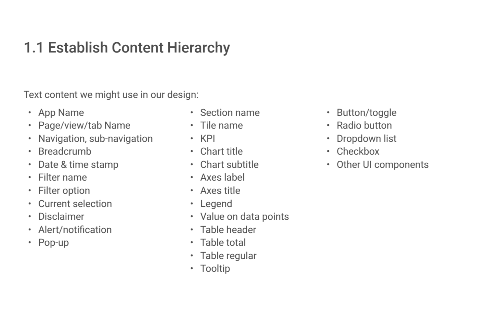

## The Complexity in our Stars or Why Data Vis is inherently hard to test

### Faster is not necessarily better

Visualization is outcome driven. Very rarely are our users making  visceral decisions based on a vis, and while we care about the affective value of a vis, we don’t want them making emotional decisions (as we would on an e-commerce site). We don’t want to penalize a vis because it makes a user think. Similarly, no. of errors is not a good measure either.

### Too many moving parts
While for some usability studies, there may be an obvious and limited set of interface elements that should be tested. In many cases, however, the system is complex, new to the researcher, or the list of candidate features for testing is long. The following image demonstrates how quickly typographic elements can scale up in a dashboard, moving well beyond the typical h1, h2, h3, and so on,  elements used in websites.


### Operationalization is a challenge
E.g. If you want to measure how many insights are derived using one visualization versus another, how do you define what constitutes an insight in the first place? 

### Datum Ipsum

It is time-consuming to produce hi-fidelity [looks-like and works-like prototypes](https://dschool-old.stanford.edu/groups/k12/wiki/e7aa3/Looks_likeWorks_like.html) with real-data backing them. While we do attempt to use meaningful placeholder data,  static mockups can only show so much.

Tools- http://datumipsum.com/


## UX Research Landscape

This section explores the wide array of research methods available to researchers based on Christian Rohrer's—Chief Design Officer in the Consumer Division at McAfee,Inc.—excellent article [When to Use Which User-Experience Research Methods](When to Use Which User-Experience Research Methods) for NNGroup.

It then attempts to make some decisions about which methods are recommended given the Axis Design context.

The following **3-dimensional framework** with the following axes helps us simplify the task of selecting a research method- 

- Attitudinal vs. Behavioral

- Qualitative vs. Quantitative

- Context of Use

  ​


**Attitudinal vs. Behavioral**

According to Rohrer's article "this distinction can be summed up by contrasting **"what people say"** versus **"what people do"** (very often the two are quite different). The purpose of attitudinal research is usually to understand or measure people's stated beliefs, which is why attitudinal research is used heavily in marketing departments."


**Quantitative vs. Qualitative**
Both quantitative and qualitative methods are valid for evaluating visualizations. You can choose to just go with one method or use a combination of both depending what you are trying to measure. Rohrer captures the essence of these two methods when he says—

"The distinction here is an important one, and goes well beyond the narrow view of qualitative as “open ended” as in an open-ended survey question.  Rather, studies that are qucalitative in nature generate data about behaviors or attitudes based on observing them *directly*, whereas in quantitative studies, the data about the behavior or attitudes in question are gathered *indirectly*, through a measurement or an instrument such as a survey or an [analytics tool](https://www.nngroup.com/articles/analytics-user-experience/)." 

He then continues to explain what these methods are suited for—

"Due to the [nature of their differences](http://www.nngroup.com/articles/risks-of-quantitative-studies/), **qualitative** methods are much better suited for answering questions about **why or how to fix a problem** whereas **quantitative** methods do a much better job answering **how many and how much types of questions.**"


This graphic from the NNGroup website succinctly sums up the landscape thus far—

**The Context of Product Use**

However there is a third dimension that has to do with direct and indirect use of the product of the service and the setting therein. In UXPin's[The Guide to Usability Testing](http://gibbon.co/c/1ada73ea-1f19-450d-bc35-64c6c436bcae/the-guide-to-usability-testing-free-ebook-by-ux) they have summarized Rohrer's note as—

```
1. Scripted use of the product — These tests focus on specific usage aspects.

The degree of scripting varies, with more scripting generating more

controlled data.

2. Decontextualized use the product — Tests that don’t use the product — at

least in the actual testing phase — are designed for broader topics like UX

or generating ideas.

3. Natural (and near-natural) use of the product — These tests seek to

analyze common usage behaviors and trends with the product, doing well

with data authenticity at the cost of control.

4. Hybrid — Hybrid tests are creative and non-traditional tests. Geared

towards understanding the users’ mentality, these tests vary in what they

can accomplish.


The Guide to Usability Testing © 2010 - 2017 UXPin Sp. z o.o 

```


## Putting a stake in the ground

WIP

— so many decisions can seem overwhelming

— but in reality goals and constraints help determine direction

— we are testing for diagnostic reasons not scientific so it is okay to use hybrid methods without too much rigidity; +Our aims are not purely scientific and still need to be adjusted to meet stakeholder needs. 

— we are testing overall UX not a very specific part, so it is okay to have broad open ended taks

— sample size is limited

