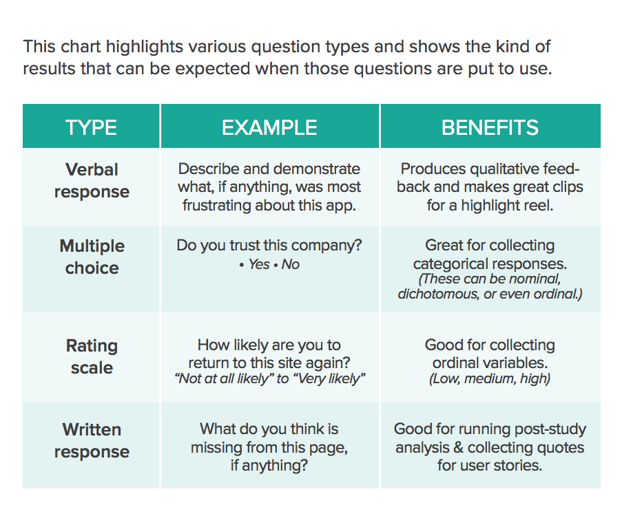
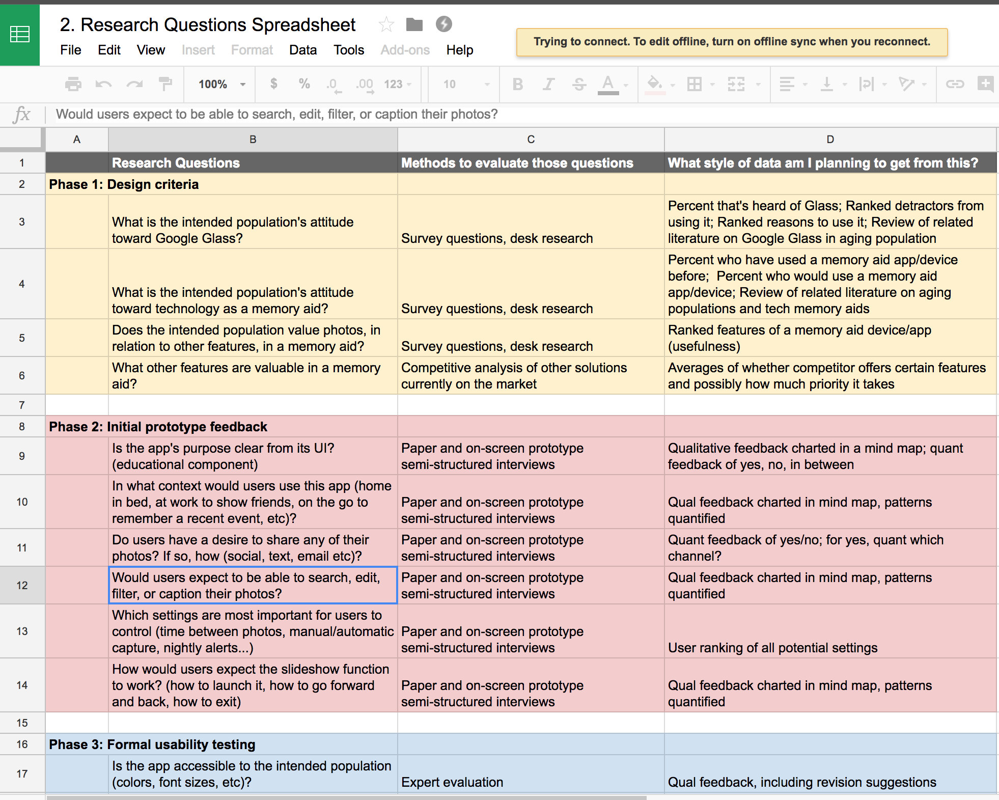

# Evaluation Toolkit
This repo is a collection of documents intended to help guide the testing process in a data visualization context. It contains guidelines that should not be followed exactly. It is written by and for the Axis Design team although it can also act as a point of reference for data vis practitioners in general.

## Goals of this repository

The goal of this repo is to serve as a **toolkit** that helps deconstruct the testing process into manageable chunks.
This toolkit aims to:

- help identify pitfalls in our current evaluation process, so designers can be more cognizant of them and control for them when possible.
- provide enough guidelines to designers to reduce the cognitive load of decision making at every stage.

Specifically, the approach advocated by this repo is:
 ```
  1. Follow best practices, don't re-invent the wheel
  2. Know what to measure 
  3. Know how to measure
  4. Act on your findings
 ```
With these guidelines designers can determine success criteria for their project, prioritize what to test versus what not to test, and identify shortcut methods to test for them. 

Where possible, this toolkit will also attempt to identify tactics designers can employ to improve their evaluation process.  
This is a **WIP** living document. Please read our [Contribution Guidelines](CONTRIBUTING.md) to help refine this repo.

## How to use this toolkit

0. **Setting the Stage**

Before beginning the tests, it is be helpful to- 
   - Understand the [pitfalls](./0.Setting-the-Stage/Pitfalls.md) with the current evaluation methodologies, in order to prevent yourself from falling into them, and
   - Understand the additional [complexity](./0.Setting-the-Stage/Challenges.md) that comes with evaluating a data visualization and,
   - Equip yourself with the [testing mindset](./0.Setting-the-Stage/TestingMindset.md) in order to properly set expectations.

1. **Follow best practices**

   At a strategic level, this serves as an initial self-directed reflection, intended to help you determine the most important design criteria for the success of your project. At a tactical level, particularly in regard to styling, it provides a reference to the [data visualization checklist](./Assets/DataVizChecklist-May2016.pdf)—prepared by Stephanie Evergreen and Ann K. Emery—to evaluate specific UI elements such as typography, color, and arrangement. Additionally, it also links to the official [Axis Style Guide](https://sites.google.com/view/style-guide/guidelines) that provides reusable techniques that we follow at Axis Group to style charts.

2. **Know what to measure**

   Next, you can begin the process of user testing by first determining what you speficially want to test and measure, and what attributes you want to prioritize for your dashboard. Do you want to test its usability, usefulness, desirability, or a combination of these attributes? Reference the [Determining what to measure](./2.Determine-research-questions/README.md) section for a list of questions that can be asked to help you determine whether your visualization achieves your prioritized attributes. After you have determined your most important design criteria, this section provides guidelines on detrmining what style of data to capture.
 
 *Source: The complete guide to user testing websites, apps, and prototypes, © UserTesting 2017*

3. **Know how to measure**

   Now that you have pinpointed the relevant questions and attributes, you can use reference this page to devise a testing plan and methodology.

4. **Act on your findings/Conveying Test Results**

   Use this [Checklist of potential actions](./5.Act-on-your-findings/Checklist-of-potential-actions.md) to recommend changes that could be made to the design inorder to address important usability issues. 

## Axis Design Sprint Testing Template

Throughout the sprint we want to track how research questions mature as the design sprint progresses and what methods were used to answer those questions. Copy over this [Google Sheets document](https://docs.google.com/spreadsheets/d/1lfcPwG4gH-rQQhl5MuXgNevy8_hlJPvdx6_RiLT34qw/edit#gid=0) to your own drive to help guide and document your testing process.

Acknowledgements: Thanks to [Arielle Cason, UX Researcher](http://ariellecason.com/) for sharing her personal test template—developed while she was a graduate student at Georgia Institute of Technology—with us. We were able to use her template as a substrate to build our own.

Here is a snippet of her template-


