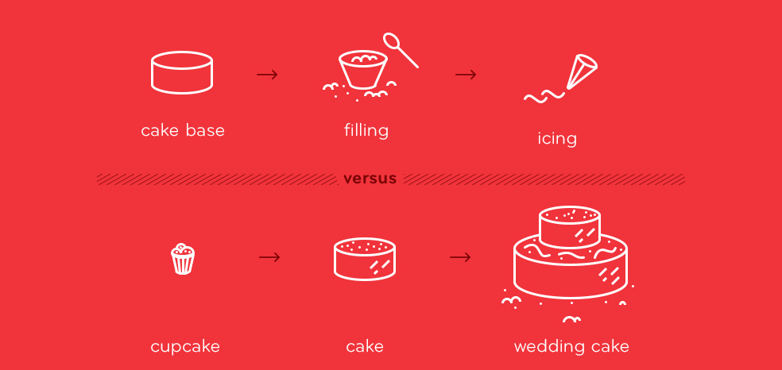

## Motivation
As designers we are often confronted with the question “How do we know our design works”?, whether it's a matter of introspection or presenting and justifying our design decisions.

And while testing seems like the obvious answer, it is important to realize that testing is not a single summative phase in the entire project (as in SDLC), but rather a formative process that is distributed throughout the design process.

In fact, testing is one of the fundamental pillars of the User-Centered Design process at Axis which is based on:

- Empathy

- Creativity
- Testing

Using these fundamentals we are able to iteratively deliver applications that are "Useful, Usable and Delightful" at every stage.

## Know your guidelines before you break them

The goal of this repository is to identify pitfalls in our current evaluation process so designers can be more cognizant of them and control for them when possibleThis document will also attempt to identify tactics designers can employ to improve their evaluation process. This is a **WIP** living document.

